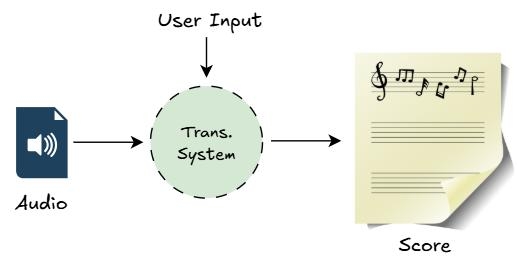

# Evaluation for Stepwise Audio to Score Models
The goal of this research is to proffer insights into the utility of stepwise piano transcription pipelines for professional musicians. 
Doing this involves a thorough systematic evaluation of transcription outputs from different models and identifying the limitations of
standard IR metrics in rightly judging their quality. The main aim is to develop transcription systems that do not replace humans but rather integrate user input into the transcription process and gives room for musicians to attach their personality and creativity to the final score.



# Dataset Extraction
This study is reliant on the [ASAP dataset](https://github.com/fosfrancesco/asap-dataset) which contains aligned quadruplets of (audio, MIDI, MIDI score, score) with corresponding
annotations. We extract these set of quadruplets on a measure level (4 measures) and store them in the data directory. To run the extraction process, copy and paste the following code:

```
python dataset.py -nm 4 -p ASAP_DATASET_PATH -o data -ts maestro
```
Note that the <i>ts</i> option represents test split. There are two options for this: <b>maestro</b> and <b>beyer</b>. Use <i>maestro</i> to use the entire ASAP dataset and use <i>beyer</i> to use the test split of [this paper](https://arxiv.org/pdf/2410.00210).

# Examples Generation
To generate example pairs for the user study, run the following:

```
python examples.py -m 1
```
The -m flag set to 1 means <i>"generate examples for MIDI"</i>. If it is 0, it means generate score-based examples. Note that for MIDI, the generated examples are based on the hFT-Transformer model by Sony and Onsets and Frames from Google, and are both trained on the MAPS dataset.

To run this as a background process, run the bash script and view the logs:

```
bash examples.sh
tail -n 1 -f logfile.log
```

# Question Generation
To generate the questions for the test, run:

```
python questions.py
```

# Web Application
The `dash_app` directory contains the code for the web app. To initialize the database, run the following:

```
cd dash_app
python database.py
```

After setting up the database, you can run the web app locally by running:

```
python -m dash_app.app
```

This should spin a local server at localhost:8050 and you can interact with the app. Once you are done with the test in the web app, you can kill the python process. 
